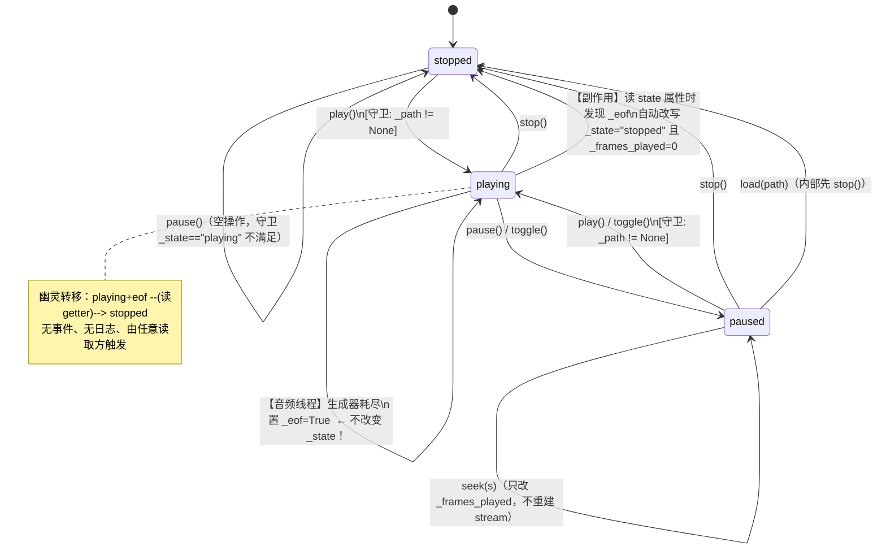

# 音乐播放器骨架 — 破坏性审计报告 V1

> 审计对象：`D:/music`（Python 3.11+ / PySide6 / python-miniaudio / PyInstaller）
> 审计范围：`src/player/engine/player.py`、`src/player/ui/main_window.py`、`src/player/app.py` 及工程脚本
> 审计立场：默认代码有罪，以代码为准，凡描述与代码冲突一律以代码为事实
> 生成时间：2026-10-09

---

## 一、架构理解（≤5 句）

1. **数据流**：UI（`MainWindow`，主线程）持有唯一 `AudioEngine` 实例，所有播放指令都是对 engine 的直接方法调用；engine 内部用一个 `miniaudio.PlaybackDevice` 承载解码后的 PCM，数据从 `miniaudio.stream_file()` 生成器经自写的 `_pcm_stream` 包装层流向声卡回调线程（非主线程）。
2. **播放内核**：不做格式协商，所有文件强制重采样到 **44.1kHz / 立体声 / SIGNED16** 后喂同一个 device；音量在 PCM 层做**线性乘法**；seek 通过销毁并重建 stream 实现，不做增量缓冲。
3. **状态流转**：只有 `stopped / playing / paused` 三个显式状态（`_state` 字符串），**没有独立的"已结束"和"错误"状态**；"自然播完"靠 `_eof` 布尔标志表达，而该标志被 `state` 这个**带副作用的 getter** 在读取时"消费"掉。
4. **持久化**：**完全没有**。无配置、无断点续播、无曲库索引、无播放历史，进程退出即遗忘。
5. **与描述不符之处**：项目自述为"播放器"，但当前骨架本质是**单文件播放 Demo**——无队列、无切歌、无扫描、无 ffmpeg 管道（`PIPE_EXTS` 仅抛错占位）。因此下文凡涉及"队列/随机/循环/服务端契约"的维度，均以**"功能未实现 → 审查其缺位导致的架构风险 + 给出设计基线"**的方式回答，并显式标注「未实现」。

---

## 二、问题清单

严重度定义：**P0**=会导致卡死/崩溃/数据错误或阻塞后续开发；**P1**=功能不正确或必踩的坑；**P2**=可维护性/体验缺陷。

| # | 模块 | 严重度 | 问题 | 触发条件 | 修复建议 | 验证方式 |
|---|------|--------|------|----------|----------|----------|
| 1 | engine `state` 属性 `player.py:127-132` | **P0** | getter 带副作用：读取 `state` 时会改写 `_state` 与 `_frames_played`。这是"幽灵状态转移"，无事件、无日志、可被任意读取方触发 | UI `_refresh` 每 250ms 读一次（`main_window.py:128`）+ `_sync_play_button` 再读一次（`:132`） | 删除副作用。改为 `state` 纯只读；在 `_pcm_stream` 结束处通过回调/信号显式发 `finished` 事件，由主线程消费并转移状态。见 §四 状态表改写 | 单测：连续读 `state` 10 次，断言 `_frames_played` 不变 |
| 2 | engine `play()` 守卫 `player.py:61` | **P0** | 守卫用**原始字段** `self._state == "playing"`，而非综合了 `_eof` 的 `state` 属性。播完后若 `state` 尚未被读取，`_state` 仍是 `"playing"`，此时 `play()` **静默 return**，重播失效 | 自然播完 → 在下一个 250ms tick 之前直接调用 `engine.play()` | 守卫改为 `if not self._path or self.state == "playing": return`（统一走综合属性），或彻底引入 `finished` 状态 | 单测：模拟 eof 后立即 `play()`，断言产生新的 stream（可用假 device 计数 `start` 调用） |
| 3 | engine 解码异常路径 `player.py:159-179` | **P0** | `_pcm_stream` 在音频线程内 `for chunk in raw`，若解码器中途抛异常，异常穿出生成器且**不会执行到 `_eof=True`**（`:179`）。状态永久停在 `playing`，UI 显示"暂停"、进度冻结，无法感知失败 | 文件损坏/读盘错误/文件被删除/移动介质拔出（Phase 1 后） | 用 `try/except` 包裹循环，捕获后置 `_eof=True` 并触发 `error` 事件；新增 `error` 状态与错误码 | 单测：注入一个会抛异常的假 decoder，断言 engine 进入 `error` 且 UI 收到通知 |
| 4 | UI 错误处理不一致 `main_window.py:107-109` | **P1** | `_on_play_pause` 直接 `self.engine.toggle()`，**没有 try/except**；而 `_on_open` 有（`:100-102`）。若 `_ensure_device()`（`player.py:148-157`）抛 `AudioError`（无声卡/设备被占用），异常会穿透 Qt 槽函数，被 Qt 吞掉打印到 stderr，**按钮状态与实际不符且用户无任何提示** | 无声卡、音频设备被独占、拔掉 USB 声卡后点播放 | 统一在 UI 边界做异常捕获（装饰器 `@guard_audio`），或让 engine 永不抛异常、改为返回结果对象/发信号 | 手工：禁用音频设备后点播放，观察是否有弹窗且按钮不进入"暂停" |
| 5 | 线程安全 `_frames_played` `player.py:105,108,177` | **P1** | `_lock` 只在 `position` 读（`:119-121`）和 `_pcm_stream` 写（`:176-177`）时使用；`play/seek/stop/load` 的写（`:57,68,70,93,105`）**全部未加锁**。锁形同虚设 | seek 与音频回调并发：`+=` 是 LOAD/ADD/STORE 三步，GIL 可在中途切换 → 丢更新；或旧回调在新基准上叠加 | 把所有 `_frames_played` 读写收敛到同一把锁；更优：用 `frame_pos` 单一权威源（音频线程只写、主线程只读，seek 走"期望位置 + 代次号 generation"）。见 §三 反例 | 压测：循环 seek 1000 次，断言 `position` 单调且最终误差 < 1 帧 |
| 6 | seek 精度 `player.py:96-108` | **P1** | seek 先 `device.stop()` 再设 `_frames_played=frame` 再 `start()`。`stop()` 不保证在途回调立即终止，旧回调可能在 `:105` 之后执行 `:177` 的 `+=`，导致新基准被污染，**进度条跳进** | 快速拖动进度条、边播边 seek | 引入 `generation` 代次号：每次 seek/load 递增，`_pcm_stream` 闭包捕获自己的代次，只有代次匹配才允许累加 | 单测：假 device 在 stop 后再触发一次回调，断言位置不漂移 |
| 7 | 音量曲线 `player.py:170-175` | **P1** | 线性幅度缩放：`sample * vol`。滑块 50% → -6dB，人耳感知约"七成响"而非一半；且 `int(s*vol)` **向零截断**，低音量下引入轻微量化失真 | 任意音量调节 | 改为感知曲线：`gain = (v)**2` 或 dB 映射 `10**(-(1-v)*60/20)`；取整改 `round()` | 单测：`v=0.5` 时断言 gain ≈ 0.25（平方律）；听感 A/B |
| 8 | 无淡入淡出 `player.py:60-94` | **P1** | play/pause/stop/seek 全部是硬切，PCM 在非零幅度处突断 → **爆音/咔哒声** | 每次播放控制操作 | 在 `_pcm_stream` 头部/尾部加 10~30ms 线性 ramp；暂停时先 ramp-out 再 stop | 听感：连续 play/pause，无咔哒；示波器看包络 |
| 9 | 无 `error` / `loading` 状态 | **P1** | 状态集合 `{stopped, playing, paused}` 不含 `loading/buffering/error`。当前 load 是同步的所以侥幸能用，但 Phase 1（ffmpeg 管道、曲库扫描）必然需要 | 引入异步加载/管道解码时 | 状态枚举扩展为 `idle/loading/playing/paused/stopped/error`，见 §四 | 状态机覆盖测试 |
| 10 | 解码器生命周期 `player.py:159-179` | **P1** | 每次 `play()` 都新建一个 `miniaudio.stream_file` 生成器（=新开解码器）；`pause/stop/seek` 只调 `device.stop()`，**从不显式 `.close()` 生成器**。反复 pause→play 会持续泄漏解码器句柄，直到 GC 才回收 | 长时间使用、频繁暂停/恢复 | 保存当前生成器引用，在 `pause/stop/seek/load/shutdown` 中显式 `gen.close()` | 资源监控：循环 pause/play 500 次，观察句柄数/内存是否稳定 |
| 11 | 生成器惰性读 `self._path` `player.py:161` | **P2** | `_pcm_stream` 是生成器函数，`self._path` 在**首次 next() 时**才求值。若在 `device.start(gen)` 与首次拉取之间 `_path` 被改（快速切歌），旧生成器会读到**新路径 + 旧 seek_frame** | 极快速的 load A → load B | 把 path 作为参数传入并在函数入口立即捕获到局部变量 | 单测：创建 gen 后改 `_path`，断言 gen 仍播原文件 |
| 12 | 轮询刷新 `main_window.py:83-86,121-129` | **P2** | 250ms 无条件 `setValue`+`setText`，暂停时也在重绘；且 `_refresh` 里读 `state`（副作用）与 `_sync_play_button` 又读一次 | 一直开着窗口 | 仅在 `playing` 时启动定时器；`_sync_play_button` 改为事件驱动；用 `QSignalBlocker` 避免回写触发信号 | Qt 性能分析：暂停时 CPU 占用应为 0 |
| 13 | 魔法数字 | **P2** | `44100/2`（`:22-23`）、`0.8`（`:36,58`）、`250`（`:84`）、`1000`（`:40`）、`32768/32767`（`:174`）硬编码散落 | — | 抽 `config.py`/`EngineConfig` dataclass | 代码审查 |
| 14 | 无日志/无错误码 | **P2** | 只有 `AudioError(str)`，UI 统一弹窗文案；无法区分"格式不支持/文件损坏/设备占用"用于埋点或自愈 | — | 定义 `ErrorCode` 枚举 + 结构化日志（`logging` 到文件） | 检查日志文件 |
| 15 | 无队列/游标/循环/随机 | **P1** | 完全缺失（见 §专项二）。当前"播完即停"，无下一首概念 | Phase 1 起点 | 按 §专项二 的 invariants 实现 | 属性测试 |
| 16 | 无媒体会话/平台中断处理 | **P2** | 无音频焦点申请/释放、无设备变更监听（见 §专项三） | 插拔耳机/切换默认设备 | 见 §专项三 | 手工插拔设备 |
| 17 | 无曲库扫描与索引 | **P2** | 仅 `QFileDialog` 单文件；10 万首场景无实现（见 §专项四） | — | 见 §专项四 | 见 §专项四 |

---

## 专项一 · 播放状态机（重点）

### ① 完整状态图（节点 + 触发事件 + 守卫）

**实际节点**（`_state` 字段的取值域）：`stopped`、`playing`、`paused`。
**隐式节点**（不在枚举里，但真实存在）：`playing+eof`（"播完待处理"）——由 `_eof=True` 表达。



### ② 不可达 / 无出边 / 缺错误边

| 类型 | 具体 | 说明 |
|------|------|------|
| **不可达状态** | 无 `error` 状态 | 解码失败无处安放，异常穿线程 |
| **不可达状态** | 无 `loading`/`buffering` 状态 | 同步 load 掩盖了它，Phase 1 必现 |
| **幽灵状态** | `playing+eof` 不在枚举内 | 存在但不可被显式查询，只能靠读 getter 触发转移 |
| **无出边状态** | `playing+eof` 在被 getter 消费前，**没有任何显式出边** | 只能等 250ms 轮询；期间 `play()` 会因守卫误判而静默失败（问题#2） |
| **缺错误边** | `playing --decode_error--> error`（缺失） | 后果即问题#3 的永久卡死 |
| **缺错误边** | `playing --device_lost--> error/paused`（缺失） | 设备被拔/切换无处理 |
| **缺错误边** | `error --retry/play--> loading`（缺失） | 无恢复路径 |
| **语义瑕疵** | `stopped --seek--> stopped` 允许改 `_frames_played` | "停止"状态却带播放位置，语义混淆；建议拆出 `ready` 状态 |
| **幂等性** | `play()` 在 playing 下幂等（返回）；`pause()` 在非 playing 下幂等（返回） | ✅ 幂等，但依赖的是**原始字段**而非综合状态，见问题#2 |
| **竞态** | 快速连点 play/pause | 主线程串行，无 UI 级竞态；但 device.stop/start 的线程边界有残留回调风险（问题#6） |

### ③ 最小反例序列（逐步推演变量值）

#### 反例 A：播完后重播静默失效（问题 #2，P0）

初始：`_state="playing"`, `_eof=False`, `_frames_played=F`（接近末尾）

| 步 | 操作/事件 | `_state` | `_eof` | `_frames_played` | UI 表现 |
|----|-----------|----------|--------|------------------|---------|
| 0 | 音频线程耗尽生成器，执行 `:179` | `playing` | **True** | `F_total` | 按钮仍"暂停" |
| 1 | （tick 未到）用户/媒体键调用 `engine.play()` | `playing` | True | `F_total` | — |
| 2 | `play()` 进入 `:61` 守卫 `_state=="playing"` → **return** | `playing` | True | `F_total` | **无任何反应，歌不重播** |
| 3 | 250ms 后 `_refresh` 读 `state`（`:128`）→ 触发副作用 | `stopped` | True | **0** | 按钮跳"播放"，进度归零 |

**结论**：在 0~3 之间任何一次直接 `play()` 都是**静默空操作**。UI 因按钮文案由轮询驱动，用户表现为"点了没反应/延迟 250ms 才恢复"。这是"幽灵状态 + 原始字段守卫"的合成 bug。

#### 反例 B：解码中途失败 → 僵尸播放（问题 #3，P0）

初始：正常播放中。中途 `raw` 生成器抛异常。

| 步 | 事件 | `_state` | `_eof` | 进度 | 说明 |
|----|------|----------|--------|------|------|
| 0 | 播放中 | `playing` | False | 递增 | — |
| 1 | 解码器抛异常（`:168`） | `playing` | **False** | **冻结** | `:179` 未执行 |
| 2 | 异常穿出生成器进入 miniaudio 回调线程 | `playing` | False | 冻结 | UI 无感知 |
| 3 | `_refresh` 读 `state`：`_eof=False` → 返回 `playing` | `playing` | False | 冻结 | 按钮"暂停"，进度条静止 |
| 4 | 用户点"暂停" | `paused` | False | 冻结 | 假死 |
| 5 | 再点"播放" → `play()` → `stream(frame)` → 再抛 | `playing` | False | 冻结 | **无限循环假死** |

**结论**：无 `error` 状态 + 异常未捕获 = 用户永远看到"在播但不动"，且无任何错误提示。这是本骨架最严重的正确性缺陷。

#### 反例 C：seek 与残留回调竞态（问题 #5/#6，P1）

| 步 | 线程 | 事件 | `_frames_played` |
|----|------|------|------------------|
| 0 | 主 | 播放中 | `F` |
| 1 | 主 | `seek(S)`：`device.stop()`（`:104`） | `F` |
| 2 | 音频 | 在途回调仍在跑，执行 `:177` `+= n` | `F+n` |
| 3 | 主 | `:105` `_frames_played = S` | `S` |
| 4 | 音频 | 又一次残留回调 `+= m` | **`S+m`** |
| 5 | 主 | `:108` `device.start(stream(S))` | 新基准已被污染 |
| 6 | 音频 | 新回调 `+= k` | `S+m+k` |

**结论**：进度条显示位置比真实播放点**超前 m 帧**（一个缓冲区，通常几十~几百 ms），歌词/进度会漂移。

### ④ 改写后的状态表（枚举 + reducer，含前后差异）

**新增状态枚举**（`engine/states.py`）：

```python
from enum import Enum, auto

class State(Enum):
    IDLE      = auto()   # 未装载任何文件
    LOADING   = auto()   # 装载/解码器初始化中（Phase 1 异步化后启用）
    READY     = auto()   # 已装载、未播放、位置可 seek
    PLAYING   = auto()
    PAUSED    = auto()
    FINISHED  = auto()   # 自然播完（替代 _eof 幽灵状态）
    ERROR     = auto()   # 带 ErrorCode
```

**事件**（`Event`）：`LOAD(path)` / `LOADED(duration)` / `LOAD_FAILED(code)` / `PLAY` / `PAUSE` / `STOP` / `SEEK(sec)` / `EOF` / `DEVICE_LOST` / `RESET`

**转移表（纯函数 reducer，无副作用）**：

```python
# (state, event) -> (new_state, actions)
TABLE = {
    (State.IDLE,     "LOAD"):        (State.LOADING,  ["start_decode"]),
    (State.LOADING,  "LOADED"):      (State.READY,    []),
    (State.LOADING,  "LOAD_FAILED"): (State.ERROR,    ["emit_error"]),
    (State.READY,    "PLAY"):        (State.PLAYING,  ["device_start"]),
    (State.READY,    "SEEK"):        (State.READY,    ["set_pos"]),
    (State.PLAYING,  "PAUSE"):       (State.PAUSED,   ["ramp_out", "device_stop"]),
    (State.PLAYING,  "SEEK"):        (State.PLAYING,  ["rebuild_stream"]),
    (State.PLAYING,  "EOF"):         (State.FINISHED, ["device_stop", "emit_finished"]),  # ← 显式边
    (State.PLAYING,  "DECODE_ERROR"):(State.ERROR,    ["device_stop", "emit_error"]),     # ← 新增错误边
    (State.PLAYING,  "DEVICE_LOST"): (State.ERROR,    ["emit_error"]),                    # ← 新增
    (State.PAUSED,   "PLAY"):        (State.PLAYING,  ["device_start"]),
    (State.PAUSED,   "SEEK"):        (State.PAUSED,   ["set_pos"]),
    (State.FINISHED, "PLAY"):        (State.PLAYING,  ["seek0", "device_start"]),         # ← 重播明确
    (State.ERROR,    "PLAY"):        (State.LOADING,  ["retry"]),                         # ← 恢复路径
    # STOP 从任意态 → READY/IDLE
}
```

**前后差异表**：

| 维度 | 改前 | 改后 |
|------|------|------|
| 状态集合 | 3 个字符串 + `_eof` 幽灵标志 | 7 个枚举，`FINISHED`/`ERROR` 显式 |
| 结束语义 | getter 副作用消费 `_eof` | `EOF` 事件 → `FINISHED` 状态，发 `finished` 信号 |
| 错误语义 | 抛异常穿线程，无状态 | `ERROR` + `ErrorCode`，有恢复边 |
| 守卫依据 | 原始字段 `_state`（问题#2） | 统一查询当前 `State` 枚举 |
| 副作用 | 分散在 getter/method | 集中在 reducer 的 `actions` 列表，由主线程执行 |
| 可测性 | 需真声卡 | reducer 纯函数，可零依赖单测全部转移 |
| 可观测 | 无 | 每次转移可日志 `state: A -> B (event)` |

---

## 专项二 · 播放队列 / 游标 / 循环 / 随机

> ⚠️ **未实现**：代码中不存在任何队列、游标、循环模式、随机模式的数据结构。以下 ①③④ 为**面向实现的设计审查基线**，②为对"当前缺位行为"的判定。

### ① shuffle 均匀性与可复现性（设计基线）

- **种子**：必须显式持有 `random.Random(seed)` 实例，`seed` 可由用户固定（"可复现洗牌"）或每次 `shuffle()` 时取 `secrets` 随机。**禁止**用全局 `random.shuffle`（污染全局状态、不可复现）。
- **重新洗牌时机**：主流惯例是 **"洗牌队列 ≠ 原始队列"**——维护 `order: list[int]`（原始索引的排列）与 `cursor: int`（在 order 中的位置）。开启随机时对 `order` 做一次 Fisher-Yates，并把**当前播放项挪到 `order[0]`**（避免"开随机后立刻跳歌"）。
- **切歌回退行为**：`prev()` 应回到 `order[cursor-1]`（即**本次洗牌序列的历史**），而非重新随机——这是 Spotify/Apple Music 的惯例；重新随机会导致"上一首"不可预测。
- **Fisher-Yates 正确性**：必须 `for i in range(n-1, 0, -1): j = rng.randrange(i+1); swap(i,j)`；**常见错误**是 `j = rng.randrange(n)`（有偏，非均匀）。

### ② 8 个边界用例判定（针对"当前缺位"）

| # | 用例 | 判定 | 原因 |
|---|------|------|------|
| 1 | 删除当前播放项 | **失败（未定义）** | 无队列概念，`load` 只能整替单文件 |
| 2 | 删除最后一项 | **失败（未定义）** | 同上 |
| 3 | 队列长度为 1 时 next/prev | **失败（未定义）** | 无 next/prev |
| 4 | 单曲循环中清空队列 | **失败（未定义）** | 无循环模式 |
| 5 | 持久化后恢复游标 | **失败（无持久化）** | 无任何落盘 |
| 6 | 空队列下 play | **部分通过** | `play()` 有 `_path` 守卫，空态不会崩，但无"空态 UI" |
| 7 | 越界 next（在末项） | **失败（未定义）** | 无 next |
| 8 | 播完自动下一首 | **失败（行为=停止）** | `:179` 置 eof → 停，而非续播 |

### ③ 队列不变式（invariants）清单 + 破坏点

**建议不变式**：
- **INV-1**：`cursor ∈ [-1, len(queue)-1]`；`queue` 非空且处于播放态时 `cursor >= 0`。
- **INV-2**：`cursor >= 0 ⟺ 当前装载曲目 == queue[cursor]`。
- **INV-3**：`order` 是 `range(len(queue))` 的**排列**（无重复、无遗漏）。
- **INV-4**：删除元素后，`order` 中所有 `> removed_index` 的元素必须 **-1 重映射**，否则 `order` 指向错位。
- **INV-5**：删除当前项后，`cursor` 必须重定位（默认顺延到"下一首"，无下一首则清空/停止），**绝不允许** `cursor` 指向被删索引。
- **INV-6**：清空队列 → `cursor=-1` 且 engine 进入 `IDLE`。
- **INV-7**：`repeat=ONE` 时 `next()` 返回同一索引；`repeat=ALL` 在末尾回绕；`repeat=OFF` 在末尾停止。

**当前代码的破坏点**：
- **INV-3/4 的破坏根源**在于**没有 `order` 与 `queue` 的分离**——一旦未来把"随机顺序"直接写进 `queue`（就地洗牌），删除元素就会破坏 `order` 与原始索引的映射。**必须在设计阶段就把 `queue`（稳定、用户可见顺序）与 `order`（播放顺序排列）分离。**
- **INV-2 已被当前代码破坏的雏形**：`load()` 只设置 `_path`，而"当前曲目"没有与任何队列绑定的标识，未来接入队列时若直接复用 `_path` 作为游标依据，会出现"文件路径重复（不同专辑同名曲）导致游标歧义"。

### ④ Property-based 测试草案（Hypothesis 风格）

```python
# test_queue_properties.py
from hypothesis import given, strategies as st, assume

@given(st.lists(st.integers(), min_size=1, unique=True))
def test_shuffle_is_permutation(items):
    q = Queue(items); q.shuffle(seed=42)
    assert sorted(q.order) == list(range(len(items)))          # INV-3

@given(st.lists(st.integers(), min_size=1, unique=True), st.integers())
def test_shuffle_reproducible(items, seed):
    assert Queue(items).shuffle(seed).order == Queue(items).shuffle(seed).order

@given(st.lists(st.integers(), min_size=1, unique=True), st.integers(min_value=0))
def test_remove_keeps_invariants(items, k):
    q = Queue(items); q.shuffle(seed=1); q.set_cursor(k % len(items))
    q.remove_current()
    assert -1 <= q.cursor < len(q.queue)                        # INV-1
    assert sorted(q.order) == list(range(len(q.queue)))         # INV-3/4
    if q.queue:
        assert q.current() == q.queue[q.cursor]                 # INV-2

@given(st.lists(st.integers(), min_size=1, unique=True), st.sampled_from(["ONE","ALL","OFF"]))
def test_next_always_valid(items, mode):
    q = Queue(items); q.repeat = mode
    for _ in range(len(items) * 3):
        q.next(); assert 0 <= q.cursor < len(q.queue)           # INV-7
```

---

## 专项三 · 性能与泄漏

### ① 可能泄漏的订阅点清单

| 类别 | 位置 | 状态 | 说明 |
|------|------|------|------|
| 定时器 | `main_window.py:83-86` | ⚠️ 低风险 | `QTimer` parent=self，随窗口销毁；但窗口若只 hide 不 destroy 会持续 250ms 唤醒 |
| 信号连接 | `:41,42,49,50,51,57` | ✅ 安全 | 连接接收者为 self，析构自动断开 |
| **音频生成器/解码器** | `player.py:159-179` | ❌ **确凿泄漏** | 每次 play 新建 `stream_file` 生成器，pause/stop/seek **从不 close** → 句柄累积到 GC |
| miniaudio Device | `player.py:148-157` | ⚠️ | 全局唯一，`shutdown` 才 close；若 `closeEvent` 未被调用（异常退出）则泄漏 |
| QFileDialog | `:90` | ✅ | 模态、局部变量，及时回收 |
| 对象/图片 URL | 无 | — | 无网络、无图片，暂不存在 |

### ② 10 万首曲库成本估算 + O(n) 热点

> ⚠️ **扫描/索引未实现**，以下为 Phase 2 的量化预判。

| 阶段 | 单次成本（估） | 10 万首总成本 | 热点 |
|------|---------------|---------------|------|
| `os.walk` 遍历 | ~1~3 μs/目录项 | ~0.3~1s | IO 密集 |
| `mutagen` 读标签 | 0.5~3 ms/文件 | **50~300 s** | **O(n) 主线程阻塞（若同步）** |
| `get_file_info`（取时长） | 5~30 ms/文件 | **8~50 min** | **致命：每文件开一次解码器** |
| SQLite 批量插入 | 100k 行/事务 ~1~2s | ~2s | 单条事务则 → 数分钟 |
| 列表渲染（QTableWidget 朴素） | — | **直接卡死** | **O(n) 创建 QWidget** |
| 列表渲染（QAbstractListModel + 虚拟化） | — | 流畅 | 正确做法 |

**O(n) 热点**：① 标签/时长读取（应移到线程池 + 批量事务 + 增量索引）；② 列表项创建（必须 model/view 虚拟化）；③ 未来"按文件夹分组/排序"若每次全量重排。

### ③ 可测量指标 + 阈值 + 定位手段

| 指标 | 阈值 | 埋点位置 | 工具 |
|------|------|----------|------|
| 首帧可播（load→首块 PCM） | < 150 ms | `load()` 入口/`_pcm_stream` 首 yield | `QElapsedTimer` |
| 切歌延迟 | < 100 ms | `play()` 前后 | 同上 |
| seek 响应 | < 50 ms | `seek()` 前后 | 同上 |
| 内存峰值（10 万曲库） | < 300 MB | 定时采样 | `tracemalloc` / psutil |
| 滚动 FPS | ≥ 55 | 列表滚动 | Qt `QFrameRate` |
| 暂停时 CPU | ≈ 0% | `_refresh` | 任务管理器 |
| 句柄数稳定性 | 500 次 pause/play 后不增长 | `pause/play` | 进程句柄计数 |

**Profiler 入口**：`python -m cProfile -o prof.out -m player.app`；实时 `py-spy top --pid <pid>`（不阻塞）；音频回调内**禁止**打日志（会引入抖动）。

### ④ 3 个低成本改造（按 ROI 排序）

1. **【ROI 最高】修解码器生命周期**：保存生成器引用，`pause/stop/seek/load` 显式 `close()`。改动 < 20 行，直接消除确凿泄漏。
2. **【中】扫描/标签读取移出主线程**：`QThreadPool` + `QRunnable`，UI 只收进度信号；SQLite 用单事务批量提交。为 Phase 2 铺路。
3. **【中】把 250ms 轮询改为事件驱动**：仅在 `playing` 时开定时器，或用 `device` 回调 → Qt `Signal` 桥接。降低空转重绘。

---

## 专项四 · 平台与中断推演

> ⚠️ **实际平台是 Windows 桌面（PySide6）**，题目给的 `{iOS/Android/Web/Electron}` 占位符与实际不符。下表**以真实平台（Windows）推演**，并给出到各占位平台的**映射**，避免误判。

| 中断 | 当前行为（Windows） | 是否正确 | 缺失的监听/回调 | 对应平台映射 |
|------|--------------------|----------|-----------------|-------------|
| 来电 | 无电话概念，不适用 | — | — | iOS `AVAudioSession.interruption` / Android `AudioFocus` |
| 闹钟响 | 系统混音，不抢占 | ✅ 可接受 | 可选 ducking | 同上来电 |
| 其他应用播放 | 共享模式混音（Windows 默认 WASAPI shared） | ⚠️ 不暂停 | **无音频会话/焦点**：应申请独占或做 ducking | Android `AUDIOFOCUS_LOSS` |
| 插入耳机 | 无处理，输出仍走默认设备 | ⚠️ | **无默认设备变更监听** | iOS route change |
| 拔出耳机 | **无处理 → 声音突然外放或静默** | ❌ | 同上，且应暂停 | iOS `AVAudioSessionRouteChange` |
| 蓝牙连接/断开 | 无处理；设备切换可能导致 device 失效 | ❌ | 同上 + 设备失效重建 | 同上 |
| 切后台 | Windows 无此概念，进程继续 | ✅ | — | iOS 需 background audio 权限 |
| 锁屏 | 继续播放 | ✅（无锁屏控件） | **无媒体会话/锁屏控件** | iOS `MPNowPlayingInfoCenter` / Android `MediaSession` |
| 低电量 | 无处理 | ⚠️ | 可选降级 | 平台省电策略 |
| 语言/深色模式切换 | Qt 需重启才完全生效 | ⚠️ | 无 `QEvent.LocaleChange`/主题监听 | — |
| 存储卸载（SD 卡/U盘） | **当前文件若在 U 盘被拔出 → 解码异常 → 僵尸播放** | ❌ | 见问题#3；需捕获 IO 错误 → error 状态 | Android `MEDIA_UNMOUNTED` |

**平台差异对照表（摘要）**：

| 能力 | Windows(当前) | iOS | Android | Web | Electron |
|------|---------------|-----|---------|-----|----------|
| 音频焦点 | 无原生等价 | AVAudioSession | AudioFocus | 无（自动） | 无 |
| 中断暂停 | 无 | interruption | AudioFocus loss | visibilitychange(可选) | 无 |
| 路由变更 | IMMNotificationClient | route change | AudioDeviceCallback | devicechange | 同 Web |
| 后台播放 | 默认允许 | 需权限 | 前台服务 | 受策略限 | 允许 |
| 锁屏控件 | SMTC | MPNowPlayingInfo | MediaSession | MediaSession API | 同 Web |

---

## 专项五 · 数据契约

> ⚠️ **本项目完全离线，无服务端**。所谓"数据契约"应重构为**外部依赖契约**：① 文件系统；② miniaudio 解码器 API；③ mutagen 标签（Phase 2）；④ ffmpeg 管道（Phase 1）。

### ① 当前对外部契约的隐式假设

| 依赖 | 隐式假设 | 风险 |
|------|----------|------|
| 文件系统 | 路径是本地常规文件、扩展名可信、读取期间不被删除 | 网络盘/拔出 U 盘 → 失败 |
| `miniaudio.get_file_info` | 返回对象有 `.duration`（`player.py:56`），且 `duration` 可转 float、可为 None | 若字段缺失/为 None → 已用 `or 0.0` 兜底，但**时长为 0 会导致 seek 全部失效**（`:98` 守卫） |
| 扩展名判定 | 扩展名 = 真实格式 | 改后缀的 m4a 会被当 mp3 → 解码失败 |
| 采样格式 | 所有文件可重采样到 44.1k/stereo/s16 | 极低采样率/单声道/超 24bit 的文件未验证 |

### ② "一旦变更就静默崩坏"的点

- `get_file_info().duration` 语义变更（如改为返回 `None`/毫秒）→ 进度条与 seek 静默错乱（当前无校验、无单位断言）。
- miniaudio 大版本升级改变 `stream_file` 的 `seek_frame` 单位（帧 vs 毫秒）→ seek 静默偏移。
- 未来 mutagen 返回的标签字段类型不一致（`str`/`list[str]`）→ UI 直接渲染时崩。

### ③ DTO / 校验层设计 + 需补的类型定义

```python
# domain/track.py
from dataclasses import dataclass, field
from typing import Optional

@dataclass(frozen=True)
class Track:
    path: str
    title: str = ""          # 降级：无标签时用文件名
    artist: str = "未知艺术家"
    album: str = ""
    duration: float = 0.0    # 秒；<=0 表示未知，UI 需容忍
    ext: str = ""
    # 校验：duration 非负；path 非空

def normalize_duration(raw) -> float:
    """外部契约 → 内部规范。容忍 None/负数/毫秒误传。"""
    if raw is None: return 0.0
    try:
        v = float(raw)
    except (TypeError, ValueError):
        return 0.0
    return max(0.0, v)
```

**降级策略**：标签缺失 → 文件名；封面加载失败 → 占位图；时长未知 → 进度条禁用但可播。

### ④ mock 数据 + 契约测试用例

```python
# test_contract.py
def test_duration_none_degrades():   assert normalize_duration(None) == 0.0
def test_duration_negative_clamped():assert normalize_duration(-3) == 0.0
def test_duration_str_coerced():     assert normalize_duration("180.5") == 180.5
def test_missing_tags_fallback():    assert Track(path="a.mp3").artist == "未知艺术家"
def test_fake_decoder_raises():      # 假解码器抛异常 → engine 进入 ERROR（配合问题#3）
    ...
```

**Mock 数据**：构造 `get_file_info` 的假返回（duration=None/0/负数/字符串）驱动上述用例。

---

## 专项六 · 先加测试再重构

### ① 最适合先写的 10 个测试（风险 × 易写程度排序）

1. `test_fmt_formats_seconds` — `_fmt()` 纯函数，边界 0/59/60/3599。
2. `test_ext_classification` — 扩展名 → NATIVE/PIPE/UNSUPPORTED 三分支。
3. `test_volume_is_perceptual` — 修音量曲线后，v=0.5 → gain≈0.25。
4. `test_state_transitions_table` — reducer 转移表全覆盖（改 §四 后可测）。
5. `test_play_after_finished_restarts` — 反例 A，验证问题#2 修复。
6. `test_decode_error_enters_error_state` — 反例 B，注入假 decoder。
7. `test_seek_position_no_drift` — 反例 C，假 device 在 stop 后触发残留回调。
8. `test_decoder_closed_on_pause` — 断言生成器 `close()` 被调用（问题#10）。
9. `test_load_invalid_ext_raises_audioerror` — 错误路径。
10. `test_shuffle_is_permutation` — 队列 property 测试。

### ② 必须先解耦才能测的模块 + 最小改动

**核心障碍**：`AudioEngine` 直接 `import miniaudio` 并 new 真实 `PlaybackDevice`（`player.py:151`），无法在无声卡/CI 环境测试。

**最小解耦**：抽出 `Backend` 协议（Protocol），注入而非硬编码：

```python
# engine/backend.py
class AudioBackend(Protocol):
    def file_info(self, path) -> object: ...
    def stream(self, path, *, seek_frame, **kw) -> Iterator: ...
    def open_device(self, **kw) -> Device: ...

class MiniaudioBackend:      # 生产实现
    ...
class FakeBackend:           # 测试实现：可控抛出、记录 start/stop/close
    ...
# AudioEngine.__init__(self, backend: AudioBackend = MiniaudioBackend())
```

### ③ 可提取的纯函数

- `_fmt(sec)`（`main_window.py:21`）→ 移入 `util/timefmt.py`。
- 扩展名分类（`player.py:45-49`）→ `classify_ext(path) -> Literal[...]`。
- 音量曲线 `linear_to_gain(v)`。
- 帧 ↔ 秒换算 `frames_to_sec / sec_to_frames`。
- 队列操作（shuffle/next/prev/remove）全部纯函数化。

### ④ 分步重构计划（每步可独立回滚）

| 步 | 内容 | 回滚方式 |
|----|------|----------|
| S1 | 抽 `Backend` 协议 + Fake，补测试 1/2/9 | 保留旧 import 路径，纯增量 |
| S2 | 修 `state` getter 副作用 + `play()` 守卫（问题#1/#2） | 单 commit 可 revert |
| S3 | 加 `error`/`finished` 状态与异常捕获（问题#3/#4） | 状态机 reducer 独立文件 |
| S4 | 修解码器生命周期 + 加锁（问题#5/#6/#10） | 独立 commit |
| S5 | 音量曲线改感知律 + 淡入淡出（问题#7/#8） | 常量开关可关 |
| S6 | 事件驱动刷新替代轮询（问题#12） | 保留轮询分支 |

---

## 三、做得好的地方（≤5 条）

1. **`_pcm_stream` 的包装设计**：把"帧计数 + 软件音量 + EOF 标记"收敛在一个生成器里，为将来 EQ/频谱预留了挂载点，思路正确。
2. **统一重采样到 44.1k/stereo/s16**：避免多格式协商，简化了 device 管理。
3. **`AudioError` 面向用户文案**：`load()` 的错误信息是"人话"（`player.py:44,47,53`），UI 可直接展示，比堆栈友好。
4. **UI 的 `_seeking` 标志**（`main_window.py:33,41`）：拖动进度条时禁止定时器回写，避免了"拖不动"的经典 bug。
5. **`position` 读加锁 + `seek` 用 `max/min` 夹紧**（`player.py:100,119-121`）：有基本的安全意识。

---

## 四、修复路线图 P0 → P1 → P2

**P0（先修，否则一切上层功能都建在流沙上）**
1. 消除 `state` getter 副作用 → 引入 `FINISHED` 状态（问题#1）。
2. 修 `play()` 守卫用综合状态（问题#2）。
3. 捕获解码异常 → `error` 状态（问题#3）。

**P1**
4. UI 边界统一异常处理（问题#4）。
5. `_frames_played` 全量加锁 + generation 代次号修 seek 漂移（问题#5/#6）。
6. 显式关闭解码器生成器（问题#10）。
7. 感知音量曲线 + 淡入淡出（问题#7/#8）。
8. 引入 `Backend` 协议解耦，补测试（专项六）。
9. 实现队列/游标/循环/随机（按专项二 invariants）。

**P2**
10. 配置抽取（问题#13）、错误码与日志（问题#14）、事件驱动刷新（问题#12）、平台中断/媒体会话（专项四）、扫描与索引（专项三）、数据契约校验层（专项五）。

---

## 五、三个月后必爆的 5 件事

1. **解码器句柄泄漏**（问题#10）：高频 pause/play 的日常使用下，句柄与内存缓慢爬升，最终表现为"用久了变卡/爆内存"——最难排查，因为它不报错。
2. **损坏文件/拔出介质导致僵尸播放**（问题#3）：一旦用户曲库里有一个坏文件，或用了移动硬盘，就会出现"歌在播但进度不动、点了没反应"的幽灵 bug，且无日志可查。
3. **seek 与播放位置漂移**（问题#5/#6）：当加入歌词高亮和精准进度后，"歌词对不上、拖完进度条对不上"会变成高频投诉，而根因是线程竞态，重构代价远高于现在修。
4. **状态语义债连锁爆发**（问题#1/#2）：一旦加队列和自动下一首，"播完→下一首"的触发点会踩到 `_eof` 幽灵状态，产生"偶尔不切歌""切歌慢 250ms"等随机性 bug。
5. **主线程阻塞**（专项三）：Phase 2 曲库扫描一旦在主线程跑，10 万首标签读取会让 UI 冻结数分钟，届时"卡死"会成为第一优先级事故，而架构上把它移出主线程需要动 `load` 的同步契约。

---

## 六、建议补充的单测/集成测试清单

**单元（纯函数/状态机）**
- `test_fmt_zero/59/60/3599`
- `test_classify_ext_native/pipe/unknown`
- `test_volume_curve_half_is_quarter`
- `test_state_reducer_all_transitions`（转移表 100% 覆盖）
- `test_play_when_finished_restarts`
- `test_play_idempotent_while_playing`
- `test_pause_idempotent_while_paused`
- `test_seek_clamps_to_duration`
- `test_seek_while_stopped_sets_position`

**集成（FakeBackend）**
- `test_decode_error_transitions_to_error`
- `test_device_open_failure_surfaces_to_ui`
- `test_pause_closes_decoder`
- `test_rapid_pause_play_no_handle_growth`（500 次循环）
- `test_seek_under_concurrent_callback_no_drift`
- `test_load_new_file_while_playing_stops_old`

**队列（属性测试，Hypothesis）**
- `test_shuffle_is_permutation`
- `test_shuffle_reproducible_with_seed`
- `test_remove_current_keeps_invariants`
- `test_next_valid_for_all_repeat_modes`
- `test_clear_queue_enters_idle`

**契约/降级**
- `test_duration_none_negative_str_coerced`
- `test_missing_tags_fallback_to_filename`
- `test_cover_load_failure_shows_placeholder`

---

## 七、还需你提供的信息（最多 8 条）

1. **`此处需要确认`**：Phase 1 的 ffmpeg 管道是走**子进程 stdout 流**还是**临时文件转码**？这决定 `load` 是否需要异步与 `loading` 状态。
2. **`此处需要确认`**：目标音频设备后端是 WASAPI shared 还是 exclusive？决定"其他应用播放"时的行为（混音 or 抢焦点）。
3. **`此处需要确认`**：曲库扫描是否要求"增量/监听文件变化"（QFileSystemWatcher）还是"一次性全量"？
4. **`此处需要确认`**：断点续播的粒度要求（每首歌位置？整个队列+游标？）——这决定持久化频率与掉电容忍。
5. **`此处需要确认`**：是否需要**独占音频设备**（影响焦点/中断策略）？
6. **`此处需要确认`**：音量滑块期望的是**感知均匀**还是**与系统音量线性对应**？（影响曲线选择）
7. **`此处需要确认`**：是否接受为解耦引入 `Backend` 抽象层（会小幅增加间接层）？
8. **`此处需要确认`**：`resources/` 目录当前为空，`build_exe.bat` 里 `--add-data "resources;resources"` 是否预留给图标/字体？影响打包路径策略。

---

## 附 · 14 项显式判定（有 / 无 / 不确定 + 依据）

| # | 检查项 | 判定 | 依据 |
|---|--------|------|------|
| 1 | 音量是否为对数/dB 曲线而非线性 | **无**（线性） | `player.py:170-175` `chunk * vol`，滑块直接线性映射（`main_window.py:57` `v/100`） |
| 2 | seek 后是否重算缓冲区间、歌词是否同步 | **无 / 无歌词** | seek 只重建 stream（`player.py:96-108`），无缓冲区概念；无歌词模块 |
| 3 | 同一资源是否可能被同时请求两次 | **无**（单文件、无网络） | 无请求层；但 `load` 会 `get_file_info` + `stream_file` **两次打开同一文件**（`player.py:51,161`） |
| 4 | 卸载时是否清理所有订阅与定时器 | **部分** | QTimer/信号随窗口析构；但**解码器生成器不清理**（问题#10），`closeEvent` 仅 shutdown device（`:134-136`） |
| 5 | 播放失败后是否有重试上限与退避 | **无** | 无任何重试；失败即抛 `AudioError` 或僵尸（问题#3） |
| 6 | 随机模式增删歌曲后是否保持听觉合理 | **无**（未实现） | 无随机模式 |
| 7 | 当前歌曲被删除后队列的行为定义 | **无**（未实现） | 无队列；文件被删 → 下次解码异常 → 僵尸（问题#3） |
| 8 | 断点续播持久化时机 | **无**（无持久化） | 无任何落盘，退出即遗忘 |
| 9 | 5 种空态（空曲库/无网/无权限/无歌词/封面失败） | **仅 1 项有** | 无曲库概念；无网络；无权限提示；无歌词；无封面。仅"文件打不开"有弹窗（`main_window.py:101`） |
| 10 | 长列表虚拟化、封面限尺寸与缓存 | **无** | 无列表视图、无封面 |
| 11 | 是否有错误码体系 | **无** | 仅 `AudioError(str)`（`player.py:26`），UI 统一弹窗 |
| 12 | 音频会话/焦点是否申请与释放配对 | **无** | 无任何音频会话/焦点 API 调用 |
| 13 | 是否存在未抽配置的魔法数字 | **有** | `44100/2`（`:22-23`）、`0.8`（`:36`）、`250`（`:84`）、`1000`（`:40`）、`32767`（`:174`） |
| 14 | 是否有同步阻塞操作在主线程 | **无（当前）** | `load` 同步但在本地小文件上够快；**Phase 1/2 引入管道解码或扫描后会变"有"**（专项三） |

---

*报告结束。所有 `文件:行` 引用均基于当前 `D:/music` 代码快照；若代码有更新请以最新为准。*
